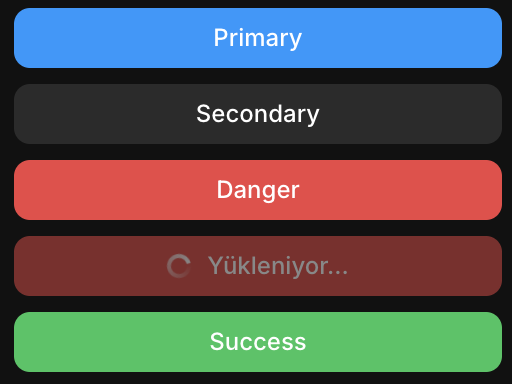
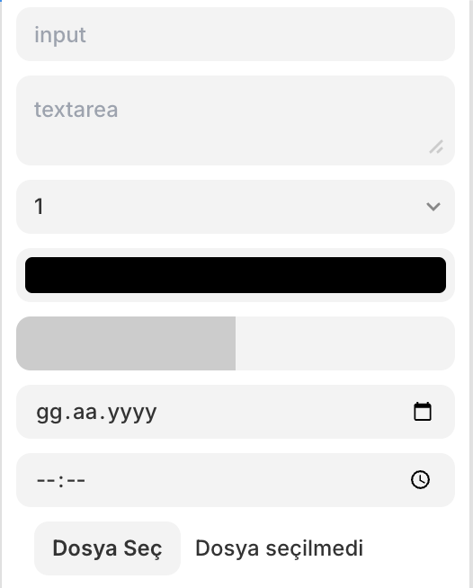
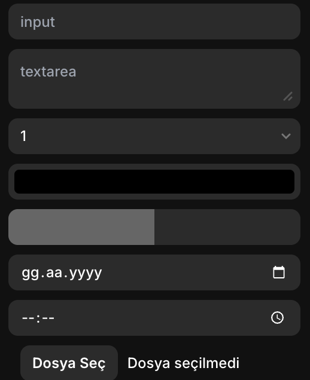
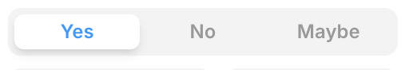
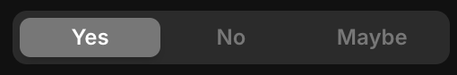
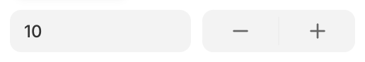
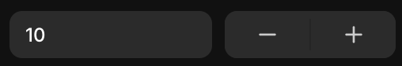
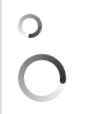

# Framer Plugin Boilerplate

Modern ve güçlü bir Framer Plugin geliştirme başlangıç kiti. Bu boilerplate, TypeScript, React, Tailwind CSS ve Vite kullanarak Framer Plugin'leri geliştirmeniz için hazır bir altyapı sunar.

## Özellikler

- ⚡️ **Vite** ile hızlı geliştirme deneyimi
- 🎨 **Tailwind CSS** ile kolay stillendirme
- 🌙 **Otomatik Dark Mode** desteği
- 🧭 **Route sistemi** ile çoklu sayfa desteği
- 🎬 **Framer Motion** ile animasyonlar
- 🔒 **TypeScript** ile tip güvenliği
- 📦 **Modern component kütüphanesi**

## Başlangıç

### Gereksinimler

- Node.js 18.0.0 veya üzeri
- npm, yarn, pnpm veya bun

### Kurulum

1. Bu repository'yi klonlayın:

```bash
git clone https://github.com/mehmetext/framer-plugin-boilerplate.git
cd framer-plugin-boilerplate
```

2. Bağımlılıkları yükleyin:

```bash
npm install
# veya
yarn install
# veya
pnpm install
# veya
bun install
```

3. Geliştirme sunucusunu başlatın:

```bash
npm run dev
# veya
yarn dev
# veya
pnpm dev
# veya
bun dev
```

## Proje Yapısı

```
├── src/
│   ├── components/     # Yeniden kullanılabilir UI bileşenleri
│   ├── screens/        # Sayfa bileşenleri
│   ├── navigation/     # Routing sistemi
│   ├── lib/            # Yardımcı fonksiyonlar
│   ├── App.tsx         # Ana uygulama bileşeni
│   └── main.tsx        # Uygulama giriş noktası
├── public/             # Statik dosyalar
└── framer.json         # Plugin yapılandırması
```

## Hazır Bileşenler

Boilerplate, Framer'ın tasarım sistemine uygun, kullanıma hazır birçok bileşen içerir:

### Button

Modern ve kullanışlı buton varyantları:

- Primary (Birincil)
- Secondary (İkincil)
- Danger (Tehlike)
- Success (Başarı)




### Input & Controls

Çeşitli form elemanları:

- Text Input (Metin Girişi)
- Textarea (Çok Satırlı Metin Alanı)
- Select (Açılır Menü)
- Number Input (Sayı Girişi)
- Color Picker (Renk Seçici)
- Date Picker (Tarih Seçici)
- File Upload (Dosya Yükleme)
- Range Slider (Aralık Kaydırıcı)




### Segmented

Bölümlü seçim kontrolü, özelleştirilebilir seçeneklerle:




### Stepper

Hassas sayısal değer kontrolü:




### Checkbox

Basit ve etkili işaret kutusu:


### Spinner

Yükleme durumları için spinner ve göstergeler:




Tüm bileşenler Framer'ın varsayılan tema değişkenlerini kullanır ve otomatik olarak Dark Mode'u destekler.

## Plugin Paketleme

Projenizi paketlemek için:

```bash
npm run pack
```

Bu komut, Framer'a yüklenmeye hazır bir `plugin.zip` dosyası oluşturacaktır.

## Özelleştirme

### Plugin Bilgileri

`framer.json` dosyasını düzenleyerek plugin meta verilerini güncelleyin:

```json
{
  "id": "your-plugin-id",
  "name": "Your Plugin Name",
  "modes": ["canvas"],
  "icon": "/icon.svg"
}
```

### Tema ve Stiller

Tailwind yapılandırması `tailwind.config.js` dosyasında bulunur. Framer'ın tema değişkenleriyle otomatik olarak çalışacak şekilde ayarlanmıştır.

## Lisans

MIT

## Daha Fazla Bilgi

Framer Plugin geliştirme hakkında daha fazla bilgi için:
[Framer Plugin Geliştirici Dokümantasyonu](https://www.framer.com/developers/plugins/introduction)
