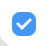
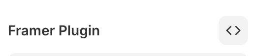
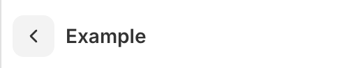
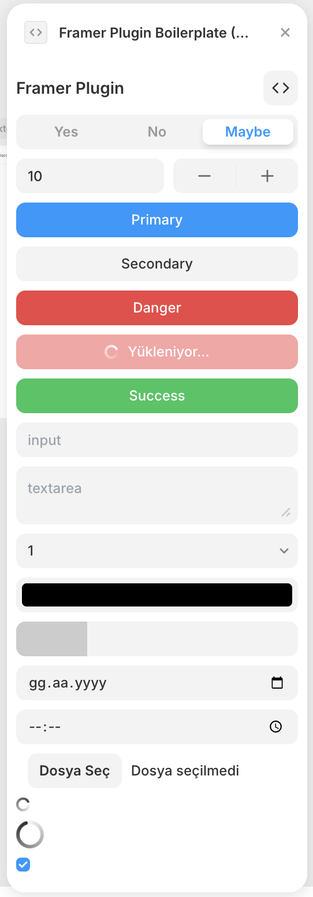
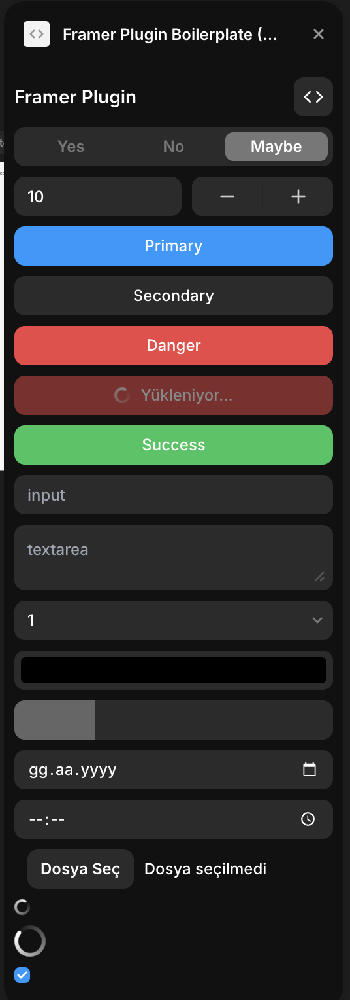

# Framer Plugin Boilerplate

A modern and powerful starter kit for Framer Plugin development. This boilerplate provides a ready-to-use infrastructure for developing Framer Plugins using TypeScript, React, Tailwind CSS, and Vite.

## Features

- ⚡️ Fast development experience with **Vite**
- 🎨 Easy styling with **Tailwind CSS**
- 🌙 **Automatic Dark Mode** support
- 🧭 Multi-page support with **Route system**
- 🎬 Animations with **Framer Motion**
- 🔒 Type safety with **TypeScript**
- 📦 **Modern component library**

## Getting Started

### Requirements

- Node.js 18.0.0 or higher
- npm, yarn, pnpm, or bun

### Installation

1. Clone this repository:

```bash
git clone https://github.com/mehmetext/framer-plugin-boilerplate.git
cd framer-plugin-boilerplate
```

2. Install dependencies:

```bash
npm install
# or
yarn install
# or
pnpm install
# or
bun install
```

3. Start the development server:

```bash
npm run dev
# or
yarn dev
# or
pnpm dev
# or
bun dev
```

## Project Structure

```
├── src/
│   ├── components/     # Reusable UI components
│   ├── screens/        # Page components
│   ├── navigation/     # Routing system
│   ├── lib/            # Helper functions
│   ├── App.tsx         # Main application component
│   └── main.tsx        # Application entry point
├── public/             # Static files
└── framer.json         # Plugin configuration
```

## Ready-to-Use Components

The boilerplate includes many components that are compatible with Framer's design system:

### Button

Modern and practical button variants:

- Primary
- Secondary
- Danger
- Success


<br />


### Input & Controls

Various form elements:

- Text Input
- Textarea
- Select
- Number Input
- Color Picker
- Date Picker
- File Upload
- Range Slider


<br />


### Segmented

Segmented selection control with customizable options:


<br />


### Stepper

Precise numerical value control:


<br />


### Checkbox

Simple and effective checkbox:


<br />

<br />


### Spinner

Spinners and indicators for loading states:


<br />


### AppBar

A suitable structure for page titles and actions:


<br />


All components use Framer's default theme variables and automatically support Dark Mode.




## Plugin Packaging

To package your project:

```bash
npm run pack
```

This command will create a `plugin.zip` file ready to be uploaded to Framer.

## Customization

### Plugin Information

Update plugin metadata by editing the `framer.json` file:

```json
{
  "id": "your-plugin-id",
  "name": "Your Plugin Name",
  "modes": ["canvas"],
  "icon": "/icon.svg"
}
```

### Theme and Styles

Tailwind configuration is located in `tailwind.config.js`. It's set up to work automatically with Framer's theme variables.

## License

MIT

## More Information

For more information about Framer Plugin development:
[Framer Plugin Developer Documentation](https://www.framer.com/developers/plugins/introduction)

## Contributing

I welcome contributions to make this boilerplate even better! Here's how you can help:

### Bug Reports & Feature Requests

- Use the GitHub Issues page to report bugs or suggest features
- Before creating an issue, please check if a similar issue already exists
- When reporting bugs, include:
  - Detailed description of the issue
  - Steps to reproduce
  - Expected vs actual behavior
  - Your environment details (OS, Node version, etc.)

### Pull Requests

1. Fork the repository
2. Create a new branch:

```bash
git checkout -b feature/your-feature-name
# or
git checkout -b fix/your-bug-fix
```

3. Make your changes and commit them:

```bash
git commit -m "Description of changes"
```

4. Push to your fork:

```bash
git push origin feature/your-feature-name
```

5. Open a Pull Request

### Development Guidelines

- Follow the existing code style and conventions
- Write clear commit messages (please use conventional commits, e.g. `feat: added new feature`)
- Update documentation as needed
- Ensure all tests pass before submitting PR
- Keep PRs focused - one feature or bug fix per PR

### Code of Conduct

- Be respectful and inclusive
- Provide constructive feedback
- Help others learn and grow
- Follow the project's coding standards

### Getting Help

If you need help with your contribution:

- Check the documentation
- Open a Discussion on GitHub
- Reach out to me through GitHub issues

Thank you for contributing to make this project better! 🎉
